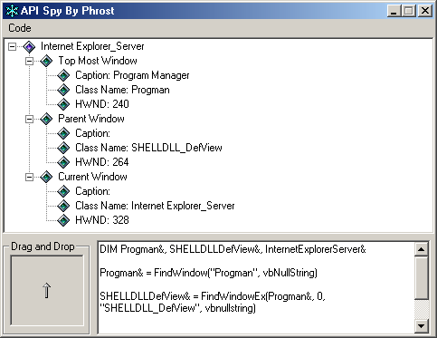



## API Spy with code generator

### Description

This program can be used to obtain handle of any visible window as well as generate the code to find that window using findwindow and findwindowex api functions. It also shows how to use drawfocusrect function to draw a rectangle around any window indicating that it has focus. All the code is commented and should be easy to understand.
 
### More Info
 

             |
---                |---
**Submitted On**   |2000-12-10 17:39:40
**By**             |[Izek](https://github.com/Planet-Source-Code/PSCIndex/blob/master/ByAuthor/izek.md)
**Level**          |Beginner
**User Rating**    |4.6 (32 globes from 7 users)
**Compatibility**  |VB 4\.0 \(32\-bit\), VB 5\.0, VB 6\.0
**Category**       |[Complete Applications](https://github.com/Planet-Source-Code/PSCIndex/blob/master/ByCategory/complete-applications__1-27.md)
**World**          |[Visual Basic](https://github.com/Planet-Source-Code/PSCIndex/blob/master/ByWorld/visual-basic.md)
**Archive File**   |[CODE\_UPLOAD1254512102000\.zip](https://github.com/Planet-Source-Code/izek-api-spy-with-code-generator__1-13485/archive/master.zip)

